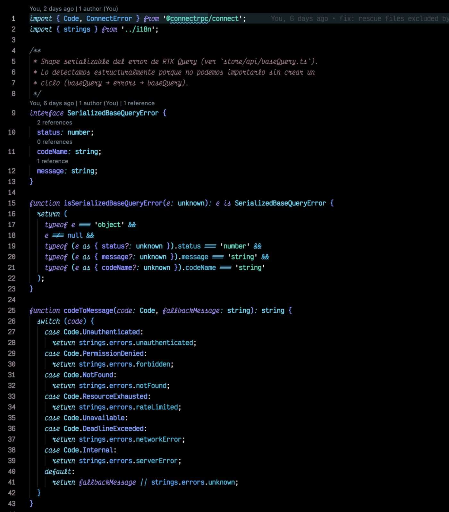
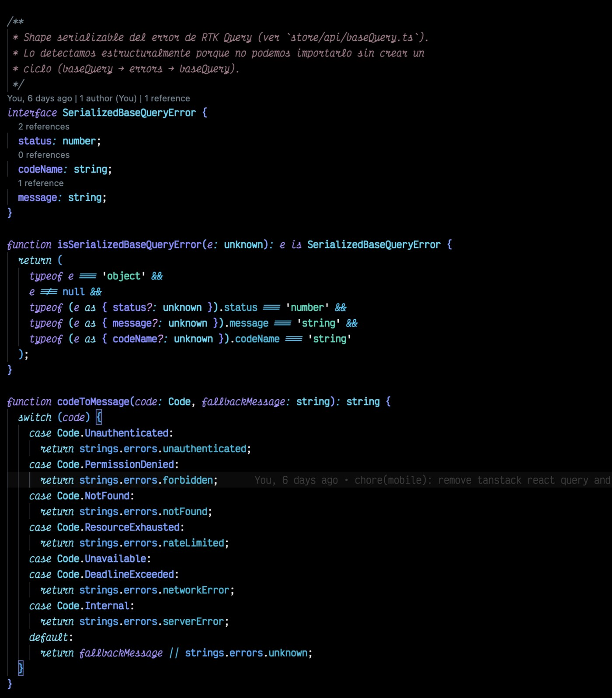

# RobbyDev

Three carefully crafted dark color themes for VS Code, Cursor, and compatible editors.

## Variants

| Theme | Background | Vibe |
|-------|------------|------|
| **RobbyDev** | `#020008` | Deep navy-black, neon magenta accents |
| **RobbyDev Black** | `#000000` | Pure black, neon magenta accents |
| **RobbyDev Mirage** | `#000000` | Pure black, vivid Ayu-inspired palette |

## Preview — RobbyDev Mirage





## Mirage Color Reference

### Syntax

| Color | Hex | Usage |
|-------|-----|-------|
| 🟣 Purple | `#d2a6ff` | Keywords, modifiers, numbers |
| 🟡 Yellow | `#ffb454` | Functions, methods, decorators |
| 🟠 Orange | `#ff8f40` | Operators, constants, enum members |
| 🟢 Lime | `#aad94c` | Strings, regex, additions |
| 🔵 Cyan | `#59c2ff` | Types, classes, namespaces, tags |
| ⚪ Foreground | `#cbccc6` | Variables, properties, text |
| 🔴 Red | `#f26d78` | Errors, deletions |
| ⚫ Muted | `#5c6773` | Comments |

### Designed For

Optimized syntax highlighting across:
- TypeScript / JavaScript / JSX / TSX
- Python
- Rust
- Go
- Java / C / C++
- Shell / Bash
- CSS / SCSS / Less
- HTML / XML
- Markdown
- YAML / TOML / JSON
- GraphQL

## Installation

### From VS Code Marketplace

```
ext install robbyfuu.robbydev-theme
```

### From Open VSX (Cursor, VSCodium, Theia)

```
ext install Robbyfuu.robbydev-theme
```

Or open the Extensions panel, search **RobbyDev**, click Install.

### Activate

`Cmd+K Cmd+T` (macOS) or `Ctrl+K Ctrl+T` (Windows/Linux), then pick:
- **RobbyDev**
- **RobbyDev Black**
- **RobbyDev Mirage**

## Recommended Pairing

Pair with a font that has italic ligatures for the best look:
- [Monaspace Radon](https://monaspace.githubnext.com/) (handwriting italics — used in screenshots)
- [Operator Mono](https://www.typography.com/fonts/operator/styles)
- [JetBrains Mono](https://www.jetbrains.com/lp/mono/)
- [Fira Code](https://github.com/tonsky/FiraCode)

## License

MIT — see [LICENSE](LICENSE).

## Author

Roberto Arce — [@robbyfuu](https://github.com/robbyfuu)
